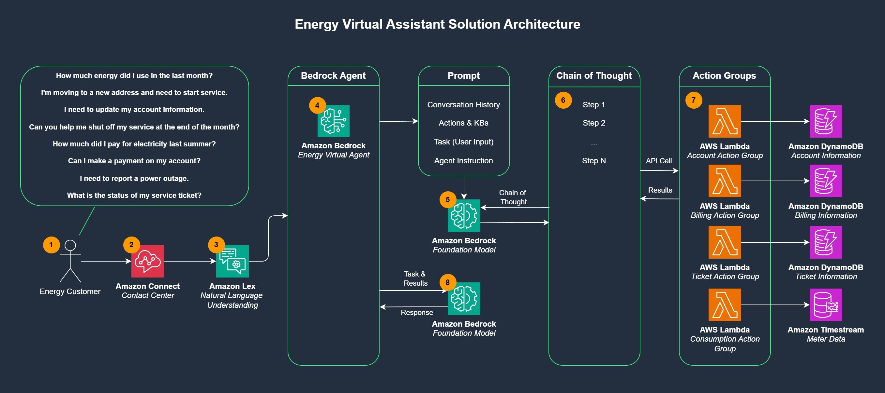
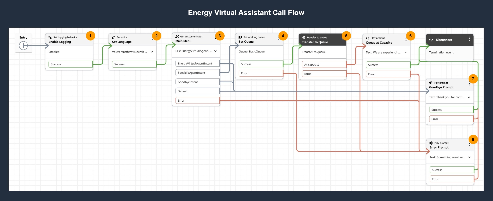

# Energy Virtual Assistant - Transforming Utility Customer Service with AWS Generative AI

## Introduction 
This repository provides a solution - the **Energy Virtual Assistant** - that is designed to support common utility customer service use cases such as reporting outages, checking consumption analytics, updating account information, and processing bill payments. Customers engage with the Energy Virtual Assistant over a voice channel, and using chain-of-thought reasoning combined with agentic integrations into enterprise systems, the virtual assistant will automatically respond to and process customer requests.

The Energy Virtual Assistant is built using a combination of AWS services, including:
- **Amazon Connect**: a cloud-based contact center solution that enables businesses to provide customer service at any scale. It supports omni-channel communication, skills-based routing, and AI powered-features including conversational IVR capabilities. Amazon Connect serves as the entry point for customers seeking to engage with the Energy Virtual Assistant over a voice channel.
- **Amazon Lex**: a fully managed artificial intelligence service for building conversational interfaces (chatbots) using voice and text. It uses the same technology that powers Amazon Alexa. Amazon Lex serves as the entry point for the Energy Virtual Assistant, providing a conversational interface with natural language understanding.
- **Amazon Bedrock**: a fully managed service that provides access to high-performing foundation models (FMs) through a unified API. Amazon Bedrock provides the generative AI capabilities that power the Energy Virtual Assistant.
- **Agents for Amazon Bedrock**: a capability that enables customers to create AI agents that can automatically break down and execute complex business tasks by orchestrating foundation models, knowledge bases, and APIs. The Energy Virtual Assistant is an Amazon Bedrock agent that uses chain-of-thought reasoning and energy system integrations to service customer requests. 
- **AWS Lambda**: a serverless compute service that executes code in response to events. It plays a crucial role in Agents for Amazon Bedrock by providing the compute layer for executing API integrations to the backend energy systems.
- **Amazon DynamoDB**: a fully managed, serverless NoSQL database service that provides fast and predictable performance with seamless scalability. Here we are using DynamoDB as a stand-in for energy Account, Billing, and Outage Management systems.
- **Amazon Timestream**: a purpose-built, fully managed time series database service designed for collecting, storing, and analyzing time-series data. Here we are using Timestream to store energy consumption data, commonly referred to as a Meter Data Management System.
- **Guardrails for Amazon Bedrock**: a feature that allows us to implement safety controls including content filtering, denied topics, word filters, and sensitive information masking to protect the interaction between the customer and the foundation model. 

This is the solution for the accompanying AWS blog post [Energy Virtual Assistant - Transforming Utility Customer Service with AWS Generative AI](https://aws.amazon.com), where you can find a more detailed write-up including step-by-step deployment instructions. 

## Solution Architecture

The solution architecture above provides an overview of the components used in this solution, and for illustrative purposes we will step through them here.

1.	Energy customers engage with the utility provider with a variety of common customer inquiries over a voice channel. Notably, while this solution is designed to service customer requests over voice, extending this solution to additional modalities such as chat or email is also possible.
2.	Customers dial into Amazon Connect and are immediately brought into an Amazon Connect contact flow.
3.	An Amazon Lex bot is embedded in the Amazon Connect flow, and serves as a speech-to-text interface for customers seeking to engage with the Energy Virtual Assistant.
4.	The Energy Virtual Assistant is backed by an Amazon Bedrock agent, which receives, processes, and responds to customer requests.
5.	The Amazon Bedrock agent takes the customer's conversation history, available actions, and the current request, and sends this to a foundation model for processing.
6.	The foundation model uses chain-of-thought reasoning to determine the appropriate steps to take to service the customer's request.
7.	Action groups represent the available actions and integrations the agent can invoke to service the customer's request. Configured actions in this solution include:
    - **Account Action Group**: performs actions such as opening new accounts, retrieving and updating account information, and closing accounts.
    - **Billing Action Group**: performs actions such as retrieving a customer's account balance and billing history, and processing customer payments.
    - **Ticketing Action Group**: performs actions such as creating service tickets, checking ticket status, retrieving all tickets for a given account, reporting outages, and scheduling maintenance.
    - **Consumption Action Group**: used to retrieve energy consumption information, provide cost estimates based on energy consumption, and explain energy consumption patterns.
    - **Date/Time Action Group**: used to determine the current date and time and facilitates range-based requests by the foundation model in service of a customer's request.
8.	Once the appropriate actions have been executed, an Amazon Bedrock foundation model is uses to process and prepare a final response to the customer.

**Note**: During the deployment process we automate the creation of fictitious customer data in the Account, Billing, and Consumption systems. Specifically, we create the following datasets:
- **AccountData**: five fictious customers, including AccountNumber, CustomerName, EmailAddress, MeterNumber, PhoneNumber, PremiseNumber, RateCode, and Service Address.
- **BillingData**: twelve months of billing data for each customer, including the BillingDate, BillingStatus, DueDate, EnergyCharge, KWhConsumption, ServiceCharge, and TotalAmount.
- **IntervalData**: three months of 15-minute interval consumption for each meter, including the L1-L2-L3 Voltage and Current, InstantaneousPower, and Frequency.

## Amazon Connect Call Flow

The call flow above illustrates the various steps taken when the customer engages with Amazon Connect over a voice channel, and for illustrative purposes we will step through them here.

1. Upon entry into the Amazon Connect flow, the **Enable Logging** block is used to enable flow logs, which are stored in Amazon Cloudwatch. Flow logs are helpful to troubleshoot the specific steps taken for a given customer call.
2. The **Set Language** block is used to set the text-to-speech (TTS) language and voice used for the contact flow.
3. The **Main Menu** block is used to provide an initial greeting to the caller, and is also where the Amazon Lex bot (and it's configured intents) are presented to the customer. Specific intents used in this call flow include:
   - **EnergyVirtualAgentIntent**: represents the Amazon Bedrock Energy Virtual Agent, and is used to service all customer requests such as reporting outages, checking consumption analytics, updating account information, and processing bill payments. This intent is configured with utterances matching various requests customers can make to the Amazon Bedrock agent.
   - **SpeakToAgentIntent**: used to route callers to a live contact center agent. This intent is configured with utterances matching customers phrases signaling they wish to speak with a live agent.
   - **GoodbyeIntent**: used to conclude the caller's interaction with the contact center. This intent is configured with utterances matching customer phrases signaling the end of the call.
4. The **Set Queue** block is used to specify the queue callers will be placed into if they wish to speak with a live agent.
5. The **Transfer to Queue** block is used to route callers to a live agent queue.
6. The **Queue at Capacity** block is used to inform customers that the queue is at capacity through a text-to-speech prompt.
7. The **Goodbye Prompt** block is used to provide a closing greeting to customers through a text-to-speech prompt.
8. The **Error Prompt** block is used to inform customers that something in the flow went wrong through a text-to-speech prompt.

## Prerequisites
Before you proceed, ensure that within your environment you have:
* [Created an Amazon Connect instance](https://docs.aws.amazon.com/connect/latest/adminguide/amazon-connect-instances.html) that will be used to support customers engaging with the Energy Virtual Assistant over an inbound voice channel.
* [Claimed an Amazon Connect phone number](https://docs.aws.amazon.com/connect/latest/adminguide/get-connect-number.html) that will be associated with the flow created during the deployment process.
* [An Amazon Connect BasicQueue](https://docs.aws.amazon.com/connect/latest/adminguide/concepts-queues-standard-and-agent.html) which is created by default with Amazon Connect.
* [Enabled access to Claude 3.5 Haiku](https://docs.aws.amazon.com/bedrock/latest/userguide/model-access-modify.html) in Amazon Bedrock, which will serve as the foundation model for the Bedrock agent.
  * **Note**: we'll be using the Claude 3.5 inference profile in this solution, which will require us to enable model access in **us-east-1**, **us-east-2**, and **us-west-2**.
* [Permissions to deploy the CloudFormation template](https://docs.aws.amazon.com/AWSCloudFormation/latest/UserGuide/control-access-with-iam.html).

## Deployment Process
Deployment of this solution is comprised of a few steps:
1. Creation of the CloudFormation stack, which deploys all base components.
2. Configuration of the EnergyVirtualAgent Lex Bot intent, which at the time of this writing does not support CloudFormation or API-driven creation.
3. Association of the Amazon Connect phone number to the Amazon Connect flow.

### Create the CloudFormation Stack
Before you begin, clone this repository to your local machine, as we will be using the YAML CloudFormation file for the first part of the deployment process.

1. Navigate to the AWS CloudFormation console and select **Create stack > With new resources (standard)**.
2. For Prerequisite – Prepare template, select **Choose an existing template** and choose **Upload a template file**.
3. Select **Choose file**, and from the cloned repository navigate to the `\deployment` folder and upload the `cloudformation_template.yaml` template file.
4. Select **Next** to proceed to the Specify stack details screen.
5. For **Stack name**, enter `EnergyVirtualAssistant`.
6. For **ConnectInstanceArn**, enter the ARN of your Amazon Connect instance.
7. For **ConnectQueueArn**, enter the ARN of your Amazon Connect BasicQueue queue.
8. Select **Next** to proceed to the Configure stack options screen.
9. Select the checkbox to **acknowledge that AWS CloudFormation might create IAM resources with custom names**.
10. Select **Next** to proceed to teh Review and create screen.
11. Review all settings and select **Submit** to create the CloudFormation stack.

After you’ve entered all details, launch the stack and wait until the stack has reached CREATE_COMPLETE status before proceeding.

### Configure Lex Bot
Once the CloudFormation stack deployment has completed we can proceed to configuring the Amazon Bedrock agent intent on the Amazon Lex bot. **Note** that we'll be using the **EnergyVirtualAgentId** and **EnergyVirtualAgentAliasId** outputs from the CloudFormation stack for this portion of the deployment.

1. Navigate to the Amazon Lex console and select the **EnergyVirtualAgentLexBot** created for you.
2. Under **Draft version** and **English (US)**, select **Intents**.
3. Select the **Add intent** drop-down and choose **Use built-in intent**.
4. Choose **AMAZON.BedrockAgentIntent - GenAI feature** for the built-in intent type.
5. For **Intent name**, enter `EnergyVirtualAgentIntent` and select **Add**.
6. For **Description**, enter `Intent to handle customer energy requests`.
7. For **Bedrock Agent ID**, enter the **EnergyVirtualAgentId** from the CloudFormation outputs.
8. For **Agent Alias ID**, enter the **EnergyVirtualAgentAliasId** from the CloudFormation outputs.
9. Navigate to the `\deployment` folder in the cloned respository and open the `agent_intent_utterances.md` file.
10. Under **Sample utterances**, select **Plain text** and paste in the utterances from the open file.
11. Select **Save intent** at the bottom of the screen.
12. Select **Build** in the upper-right corner of the screen to apply the changes.
13. Navigate to the **Bot versions** screen and select **Create version**. 
14. Select **Create** to create a new bot version and wait until this is complete.
15. Under **Deployment**, select **Aliases** and select the **PROD** alias.
16. Select **Associate version with alias** and select the new version just created.
17. Select **Associate** when complete.

### Associate Phone Number
We're now ready to associate the previously claimed Amazon Connect phone number with the contact flow created as part of the CloudFormation stack deployment.

1. Login to your Amazon Connect instance and navigate to the **Phone numbers** screen.
2. Select your phone number from the list.
3. Under **Contact flow / IVR** enter `EnergyVirtualAgentFlow` in the search box.
4. Select the **EnergyVirtualAgentFlow** and select **Save** to associate the phone number with the flow.

## Test the Solution
Included in this repository under the `\test` folder are various different test scenarios you can use to interact with and test the Energy Virtual Assistant. 

To do so, simply call into the Amazon Connect phone number you associated with the contact flow and ask questions of the Amazon Bedrock agent, using fictitious account information as neeeded and which has been preloaded for you.

## Customizing the Solution
Readers are encouraged to customize this solution to meet their needs, and can do so after cloning the repository to their local machine. Notably, the backend DynamoDB and Timestream tables being used as stand-ins for CRM, Billing, Outage, and Meter Data Management systems will likely be different in a real-world environment. Effort should be taken to first understand the type of customer requests you want to service with this solution, followed by customization of the backend systems needed to support these interactions. This solution is primarily designed to illustrate the art-of-the-possible for generative AI enabled assistants and serve as a acceleration vehicle for proof-of-concept activities.

## Solution Cleanup
To remove the solution and avoid incurring additional charges for the AWS resources used in this solution, perform the following steps.

1. Login to your Amazon Connect instance and navigate to the **Phone numbers** screen.
2. Select your phone number from the list.
3. Under **Contact flow / IVR** enter `EnergyVirtualAgentFlow` in the search box.
4. Deselect the **EnergyVirtualAgentFlow** and select **Save** to remove the phone number association from the flow
5. Navigate to the CloudFormation console in your AWS account.
6. Locate the `EnergyVirtualAssistant` stack and choose **Delete**.
   * **Note**: This will delete all resources deployed by this CloudFormation stack, with the exception of the CloudWatch log groups created for the AWS Lambda functions and Amazon Connect instance. You may choose to retain them or delete them. 

## Summary
In this solution we demonstrated how to build agentic solutions on Amazon Bedrock and use these with a combination of AWS services to facilitate customer service workflows. Using generative AI for customer service provides numerous benefits above and beyond traditional IVR systems, including the ability to break free from rules-based IVR trees, provide customer service around the clock, and seamlessly scale during periods of high usage, to name a few.

We encourage you to deploy, test, and customize this solution within your environment to immediately realize the value of using generative AI to enhance customer service.

## Contributing
See [CONTRIBUTING](./CONTRIBUTING.md) for more information.

## License
See [LICENSE](./LICENSE) for more information.